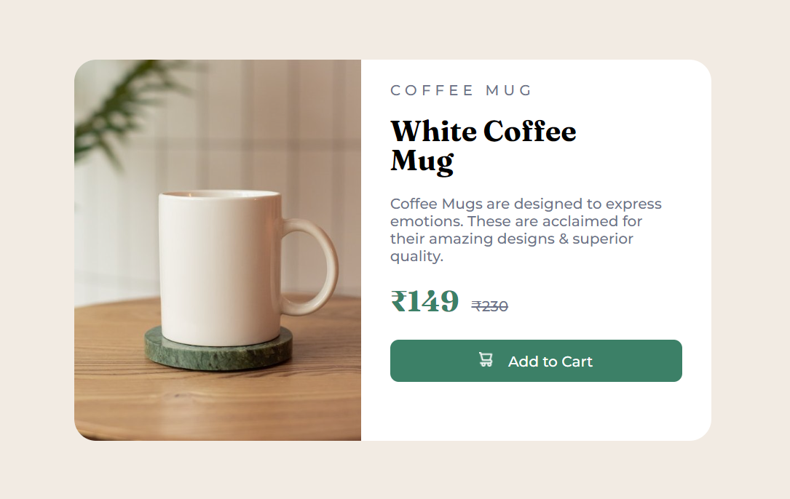

# CSS Mini Projects

Welcome to my collection of CSS Mini Projects. In this repository, you'll find a variety of small web projects, each showcasing different CSS techniques and design concepts.

## Projects

### 1. Image Gallery

- View Project: [Image Gallery](https://skimran-coder.github.io/Image-Gallery/)
- Description: Explore a beautiful image gallery created with CSS. Click on images to view them in full size.

### 2. Modern Chair Page

- View Project: [Modern Chair Page](https://skimran-coder.github.io/Modern-Chair-Page/)
- Description: Experience a modern chair showcase page with sleek CSS design and responsive layout.

### 3. Parallax Webpage

- View Project: [Parallax Webpage](https://skimran-coder.github.io/Parallax-Website/)
- Description: Dive into the world of parallax scrolling with this captivating webpage that creates a 3D effect as you scroll.

### 4. Product Card

- View Project: [Product Card](https://skimran-coder.github.io/Product-Card/)
- Description: Explore a stylish product card design that you can use as part of an e-commerce website or product showcase.

## Usage

Feel free to click on the "View Project" links to see each project in action. These projects are great examples of how CSS can be used to enhance the visual appeal and interactivity of web pages.

## About the Author

These projects are created by [Your Name]. You can find more of my work on my GitHub profile: [My GitHub Profile](https://github.com/skimran-coder).
